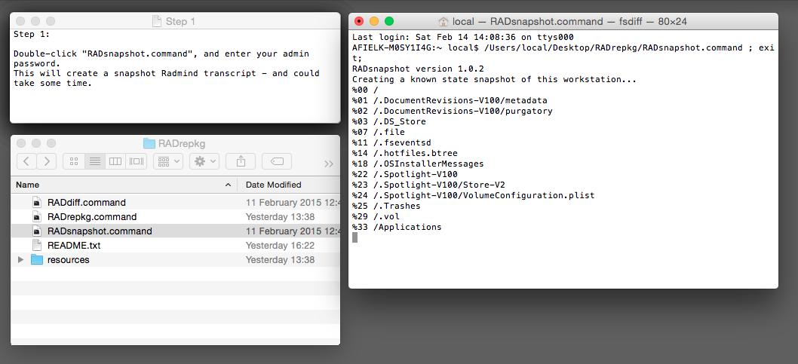
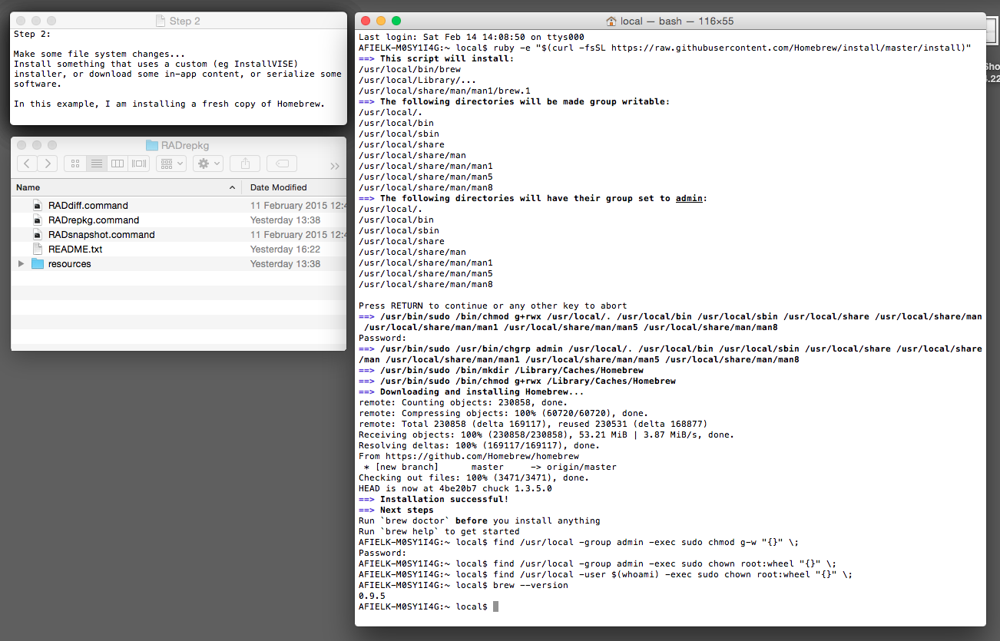
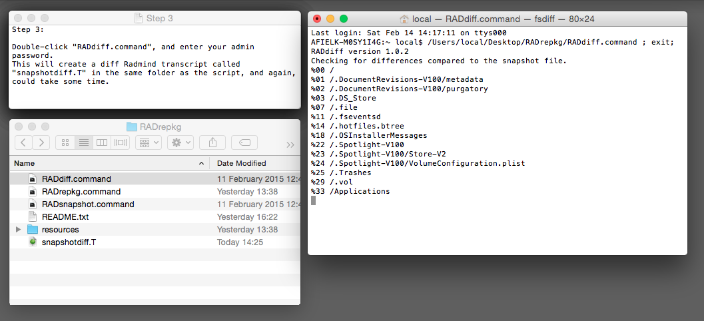
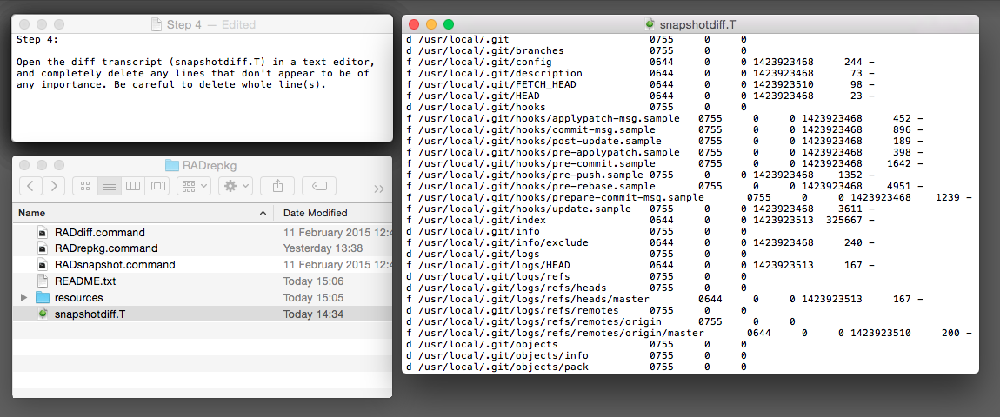
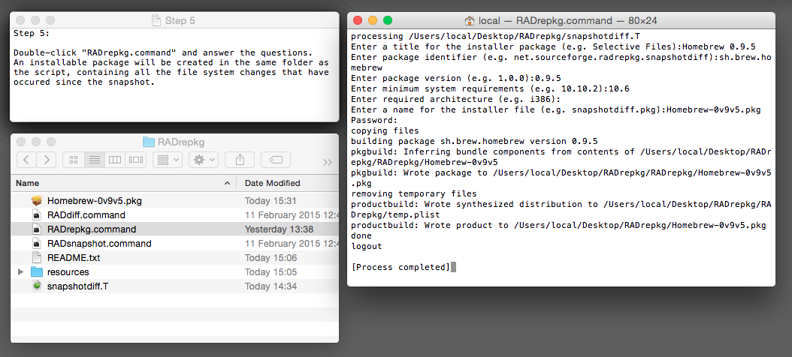
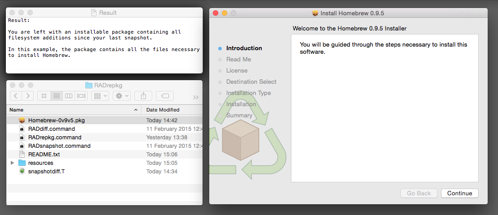

# RADrepkg
Make an OSX install package of file system changes since a snapshot

##Description:

RADrepkg comprises of three scripts RADsnapshot, RADdiff and RADrepkg - that make use of "Radmind Tools" and Apple's "pkgbuild" and "productbuild" commands, in order to make an installable package of file system changes that have occured since a defined snapshot.

To use RADrepkg, you do not need a Radmind Server - just RADrepkg and the Radmind Tools.

If at some point you have used Radmind as a deployment method, RADrepkg can also be used to repackage software that has already been deployed to a workstation.

Again, you don't need a Radmind server - in this case, it is only important that the software and the associated radmind transcript are both still on the workstation.

##Installation:

1. Download and unzip the "RADrepkg" scripts to a convenient location.
   
   (Note, the scripts need to be run from a volume that has ownership enabled)

2. Download and install the [Radmind Tools](http://sourceforge.net/projects/radmind/ "Radmind Tools")

##How to use:

###Example 1

**Creating a snapshot and packaging up file system changes**

If you want to create an installable package containing all filesystem additions since some pre-defined point, do this:

1. Double-click "RADsnapshot.command", and enter your admin password.

   This will create a snapshot Radmind transcript - and could take some time.

	
   
2. Make some file system changes...

   Maybe install something that uses a custom installer (eg InstallVISE), or download some in-app content, or maybe serialize some software.

	
   
3. Double-click "RADdiff.command", and enter your admin password.

   This will create a diff transcript called "snapshotdiff.T" in the same folder as the script, and again, could take some time.

	

4. Open the diff transcript (snapshotdiff.T) in a text editor, completely delete any lines that don't appear to be of any importance.

   Be careful to delete whole line(s).

	
   
5. Double-click "RADrepkg.command" and answer the questions.

	

   An installable package will be created in the same folder as the script, containing all the file system changes that have occured since the snapshot was created.
   
   You don't need a Radmind server.

	

###Example 2

**Packaging up an existing radmind transcript**

If a Radmind server has been used to deploy software to your workstation, then it is possible that the deployment transcripts are still on your boot drive within the folder "/private/var/radmind/client".
 
If this is the case, you can use these transcripts to create installable packages of the deployed software as follows:

1. Open a Terminal window

2. Pass an existing Radmind transcript to the RADrepkg script, e.g:

     RADrepkg.command /private/var/radmind/client/sometranscript.T

3. Enter your password (you must have admin privileges) and answer the questions.

   An installable package will be created in the same folder as the script, containing all the files and folders defined by the transcript.

   You don't need a Radmind server.

##History:

1.0.7 - 07 JUN 2016

* Updated the exclude file.

* Moved to GitHub

1.0.6 - 13 OCT 2015

* Supports 10.4 - 10.11

* Updated the exclude file.

* Scripts exit if not an admin user

* Added RadmindTfix4SIP script to bin directory to support OS X with System Integrity Protection.

* RADrepkg.command now uses lmerge when processing command (K) files (simplifying the script somewhat)

* Bug fixed that prevented it working correctly on OS X 10.6

1.0.5 - 26 AUG 2015

* Radmind binaries can be put in the scripts bin directory, allowing the scripts to run without installing the Radmind tools.

* Negative transcripts updated for different versions of OSX.

* Exclude command file updated.

1.0.4 - 21 MAR 2015

* Scripts made compatible with early OS versions from 10.4 onwards. OS versions prior to 10.7 require that you download a compatible version of PackageMaker.app

1.0.3 - 22 FEB 2015

* RAD-exc.T
  Minor modification.

* RADsnapshot.command 
  Names the snapshot with a version and lets you know where it saved. Backs up any existing command.T file. Ignores mount points. Tells you how long it took to run.

* RADdiff.command
  Ignores mount points.
  Tells you how long it took to run.

1.0.2 - 13 FEB 2015

* RADsnapshot.command
  Disabled checksum when executing fsdiff.

* RADdiff.command
  Disabled checksum when executing fsdiff.

* RADrepkg.command
  When used to process existing Radmind transcript files, the script can now deduce all other command-line options provided that the transcript filename follows a particular naming convention:
  
  (Type-Vendor-Product[-ProductDesc]-Version-MinSystem-Architecture.T).
  
  The script can now process nested command files as well as transcripts.

* RAD-neg.T
  Minor modification (group ownership record on .fseventsd fixed).

* RADrepkg.png
  Artwork modified.

* Added some walk-through screenshots.

1.0.1 - 17 NOV 2014

* First release.
  Tidied up my scripts so I could release them to the wild.
